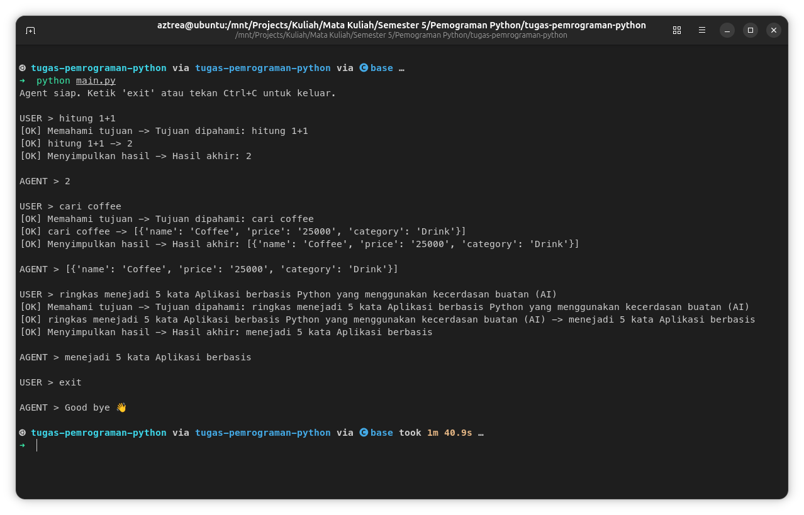

# Agent sPython

Project ini adalah implementasi agen interaktif sederhana menggunakan Python. Agen ini dirancang untuk memahami masukan pengguna, membuat rencana, dan mengeksekusi tugas menggunakan berbagai *tools* yang terintegrasi.

## Fitur

-   **Perencanaan Dinamis**: Agen dapat membuat rencana berdasarkan masukan pengguna.
-   **Manajemen Memori**: Agen memiliki memori untuk menyimpan hasil dari langkah-langkah sebelumnya.
-   **Manajemen State**: Melacak status eksekusi saat ini.
-   **Logging**: Mencatat setiap langkah dan hasilnya untuk *debugging* dan analisis.
-   **Integrasi Tools**:
    -   **Kalkulator**: Melakukan perhitungan matematis sederhana.
    -   **Pencarian CSV**: Mencari kata kunci dalam file CSV (`data/data.csv`).
    -   **Ringkasan Teks**: Meringkas teks hingga jumlah kata tertentu.

## Struktur Project

-   `core/`: Berisi logika inti agen, termasuk `Agent`, `Planner`, `Memory`, `State`, dan `Logger`.
-   `data/`: Direktori untuk menyimpan file data, seperti `data.csv` yang digunakan oleh *tool* pencarian CSV.
-   `tools/`: Berisi implementasi dari berbagai *tools* yang dapat digunakan agen.
-   `main.py`: Titik masuk utama aplikasi yang menjalankan interaksi agen.

## Cara Menjalankan Project

Untuk menjalankan agen ini, ikuti langkah-langkah berikut:

1.  **Clone repositori** (jika belum):
    ```bash
    git clone https://github.com/your-username/tugas-pemrograman-python.git
    cd tugas-pemrograman-python
    ```
    (Ganti `https://github.com/your-username/tugas-pemrograman-python.git` dengan URL repositori yang benar)

2.  **Buat lingkungan virtual** (direkomendasikan):
    ```bash
    python -m venv .venv
    ```

3.  **Aktifkan lingkungan virtual**:
    -   Di Windows:
        ```bash
        .venv\Scripts\activate
        ```
    -   Di macOS/Linux:
        ```bash
        source .venv/bin/activate
        ```

## Penggunaan

Setelah menjalankan `main.py`, Anda dapat berinteraksi dengan agen melalui *command line*. Berikut adalah beberapa contoh perintah yang dapat Anda gunakan:

-   **Menggunakan Kalkulator**:
    ```
    USER > hitung 10 + 5 * 2
    ```
-   **Mencari di CSV**:
    ```
    USER > cari Coffee
    ```
    (Pastikan file `data/data.csv` ada dan berisi data yang sesuai)
-   **Meringkas Teks**:
    ```
    USER > ringkas ini adalah contoh teks yang sangat panjang yang perlu diringkas menjadi 5 kata
    ```
-   **Keluar dari Agen**:
    ```
    USER > exit
    ```
    Atau tekan `Ctrl+C`.

## Demo

---
*Proyek ini dikembangkan untuk memenuhi tugas mata kuliah Pemrograman Python.*
